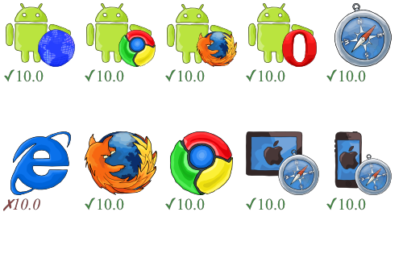
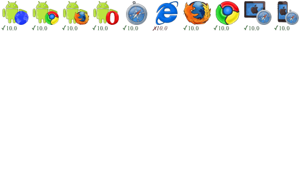
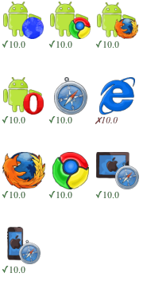

badge-render
============

A Node.js + PhantomJS based solution to generate browser testing results badge


LOGO images from https://github.com/substack/browser-badge

Install
-------

```
npm install badge-render
```

Commandline Usage
-----------------

**Generate your badge by badge json**

```sh
badge-render examples/all_browsers_pass.json lib/index.html
```

* The input JSON: <a href="examples/all_browsers_pass.json">examples/all_browsers_pass.json</a>
* The output HTML: <a href="lib/index.html">lib/index.html</a>
* The output PNG: 

**Options: Output png with another name**
```sh
badge-render examples/all_browsers_pass.json lib/index.html --png test.png
```

**Options: Scale the html and png**

This feature is supported by updating PhantomJS zoomFactor.

```sh
badge-render examples/all_browsers_pass.json lib/index.html --png examples/scale.png --scale 0.5
```

* The output PNG: 

**Options: Change the rendered image size**

This feature is supported by changing PhantomJS viewport size. Default viewport size is 500x320. When the real HTML size larger, the rendered image size will auto expanded.

```sh
badge-render examples/all_browsers_pass.json lib/index.html --png examples/small.png --scale 0.6 --width 180 --height 200
```

* The output PNG: 

**Options: customize the style**

Append your css file into the HTML.

```sh
badge-render examples/all_browsers_pass.json lib/index.html --png examples/style.png --css examples/extra.css
```

* The CSS file: <a href="examples/extra.css">examples/extra.css</a>
* The output PNG: 

CommonJS Usage
--------------

```javascript
var badge = require('badge-render');

// generate HTML by default handlebars template
badge({
 browsers: {
   safari: {'10.0': true},
   explorer: {'10.0': false},
   firefox: {'10.0': true}
 }
});

// provide more options
badge({
  browsers: {...},
  title: 'change title of the html (default template)',
  assets: 'change the assets base url (default template)',
  template: 'template string',
  css: 'css string for template (default template)'
}, {
  file: 'full path of output file',
  hbfile: 'full path of handlebars template',
  cssfile: 'full path of css file to customize default template'
});
```
